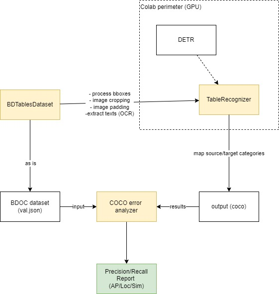

# PubTables-1M


- Quick Start: [](https://colab.research.google.com/drive/1CePiqlZfJa_tLTCzbatOKahWlyEAMgQa?usp=sharing)

- Pre-trained weights: [Link](https://drive.google.com/drive/folders/1Ko4Trk48u99AAPNU41RcUKAoMP0BoDmU?usp=sharing)

- Export to coco results colab: https://colab.research.google.com/drive/10NXNazTstmP8ZhYoDjHsA0LwHFUyaaOv?usp=sharing 

- Evaluate (GritTS) colab: https://colab.research.google.com/drive/1t3Nje_bqEU_U7x_4scPGvbDTk92XYI26?usp=sharing
- 
## Update: 
- Apr 3 2022:
  - Release pre-trained weights (20 epochs)
  

## Code Installation
Create a virtual environment and activate it as follows
```
python -m venv env; source env/bin/activate
pip install -U pip

pip install -r requirements.txt
```

## Evaluation
Method to evaluate metrics like precision/result: 


python .\coco_error_analysis.py --ann ./data/nc_ttv/val/val.json ./data/nc_ttv/coco_out/coco_detection_output.json,./
data/nc_ttv/coco_out/coco_structure_output.json  ./data/nc_ttv/coco_out

```bash 
streamlit run app.py
```

[Original README](https://github.com/microsoft/table-transformer)
